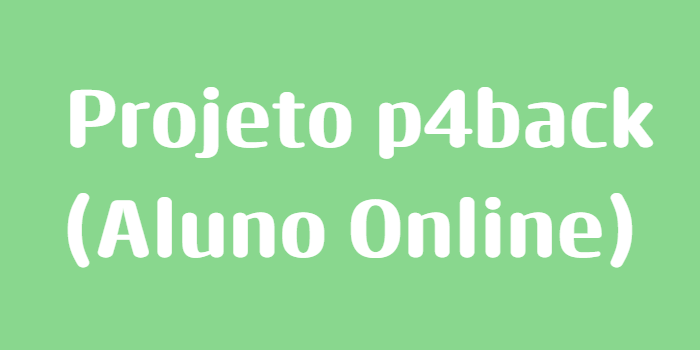

<hr>

<div align=center>

# Olá, sejam bem-vindos! 👋

<hr>



<hr>

</div>

## 📖 Sumário

- [Sobre](#-sobre)
- [Detalhes Técnicos](#-detalhes-técnicos)
    - [Tecnologias e Frameworks](#-tecnologias-e-frameworks)
    - [Estrutura do Projeto](#-estrutura-do-projeto)
    - [Configuração do Ambiente](#-configuração-do-ambiente)
    - [Autenticação](#-autenticação)

## 📚 Sobre
- Projeto **P4 - Tecnologia para Back-end Avançado** baseado no sistema **Aluno Online (P3)**;
- Adicionada **autenticação via JWT (Bearer Token)** para proteger os endpoints;
- Sistema de cadastro de **Alunos, Professores e Disciplinas**.

## 📈 Detalhes Técnicos

### 📚 Tecnologias e Frameworks
- **Java** (versão 22)
- **Spring Boot** (versão 3.x)
- **Maven** para gerenciamento de dependências
- **Banco de dados MySQL**
- **Swagger** para documentação da API
- **Insomnia** para testes das APIs
- **DBeaver** para visualização e manipulação do banco de dados

### 🗂️ Estrutura do Projeto
api/
<br>
├── src/<br>
│   ├── main/<br>
│   │   ├── java/<br>
│   │   │   └── br/com/alunoonline/api/<br>
│   │   │       ├── controller/      
│   │   │       ├── domain/      
│   │   │       │   ├── aluno/<br>
│   │   │       │   ├── disciplina/<br>
│   │   │       │   ├── professor/<br>
│   │   │       │   └── usuario/<br>
│   │   │       ├── dtos/               
│   │   │       ├── enums/         
│   │   │       ├── infra/           
│   │   │       │   ├── exception/<br>
│   │   │       │   ├── security/<br>
│   │   │       │   └── springdoc/<br>
│   │   │       └── service/             
│   │   │
│   │   ├── resources/<br>
│   │   │   ├── static/     <br>              
│   │   │   ├── templates/     <br>           
│   │   │   ├── application.properties   <br>
│   │   │   └── application-prod.properties.properties  <br>
│   │
│   └── test/                    
│
└── target/<br>

### 🛠️ Configuração do Ambiente
1. Instale o **Java 17** e o **Maven**.
2. Configure o banco de dados **MySQL** e ajuste as credenciais no `application.properties`.
3. Execute `mvn spring-boot:run` para iniciar o projeto.

## 🔐 Autenticação

Todos os endpoints protegidos exigem um **Bearer Token** no cabeçalho da requisição.

### 📌 Exemplo de Login (gerar token)
**POST** `/login`

Request Body:
```json
{
  "username": "admin",
  "password": "admin123"
}